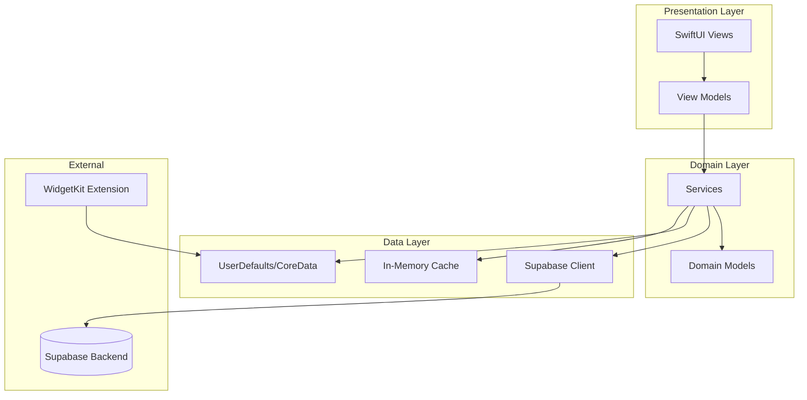

# Design Document: QuoteVault

## Overview

QuoteVault is a SwiftUI-based iOS application that provides quote discovery, collection management, and personalization features backed by Supabase for authentication and data persistence. The app follows MVVM architecture with a clean separation between UI, business logic, and data layers.

## Architecture



### Architecture Decisions

1. **MVVM Pattern**: ViewModels handle business logic and state, Views are purely declarative
2. **Service Layer**: Encapsulates all Supabase interactions and business rules
3. **Repository Pattern**: Abstract data sources behind protocols for testability
4. **Dependency Injection**: Services injected via environment objects for flexibility
5. **Combine Framework**: Reactive data flow between layers

## Components and Interfaces

### Authentication Module

```swift
protocol AuthServiceProtocol {
    var currentUser: AnyPublisher<User?, Never> { get }
    var isAuthenticated: Bool { get }
    
    func signUp(email: String, password: String) async throws -> User
    func signIn(email: String, password: String) async throws -> User
    func signOut() async throws
    func resetPassword(email: String) async throws
    func updateProfile(name: String?, avatarData: Data?) async throws
    func restoreSession() async throws -> User?
}

class AuthService: AuthServiceProtocol {
    private let supabase: SupabaseClient
    private let userSubject = CurrentValueSubject<User?, Never>(nil)
    // Implementation details...
}
```

### Quote Service Module

```swift
protocol QuoteServiceProtocol {
    func fetchQuotes(page: Int, pageSize: Int, category: QuoteCategory?) async throws -> [Quote]
    func searchQuotes(query: String, searchType: SearchType) async throws -> [Quote]
    func getQuoteOfTheDay() async throws -> Quote
    func refreshQuotes() async throws -> [Quote]
}

enum SearchType {
    case keyword
    case author
}

class QuoteService: QuoteServiceProtocol {
    private let supabase: SupabaseClient
    private let cache: QuoteCacheProtocol
    // Implementation details...
}
```

### Collection Manager Module

```swift
protocol CollectionManagerProtocol {
    var favorites: AnyPublisher<[Quote], Never> { get }
    var collections: AnyPublisher<[QuoteCollection], Never> { get }
    
    func toggleFavorite(quote: Quote) async throws
    func isFavorite(quoteId: UUID) -> Bool
    func createCollection(name: String) async throws -> QuoteCollection
    func deleteCollection(id: UUID) async throws
    func addToCollection(quoteId: UUID, collectionId: UUID) async throws
    func removeFromCollection(quoteId: UUID, collectionId: UUID) async throws
    func getQuotesInCollection(collectionId: UUID) async throws -> [Quote]
    func syncFromCloud() async throws
}

class CollectionManager: CollectionManagerProtocol {
    private let supabase: SupabaseClient
    private let localStorage: LocalStorageProtocol
    // Implementation details...
}
```

### Notification Scheduler Module

```swift
protocol NotificationSchedulerProtocol {
    func requestPermission() async throws -> Bool
    func scheduleDaily(at time: DateComponents, quote: Quote) async throws
    func cancelAllNotifications() async
    func updateNotificationTime(_ time: DateComponents) async throws
}

class NotificationScheduler: NotificationSchedulerProtocol {
    private let notificationCenter: UNUserNotificationCenter
    // Implementation details...
}
```

### Theme Manager Module

```swift
protocol ThemeManagerProtocol {
    var currentTheme: AnyPublisher<AppTheme, Never> { get }
    var colorScheme: ColorScheme? { get }
    var accentColor: Color { get }
    var quoteFontSize: CGFloat { get }
    
    func setColorScheme(_ scheme: ColorScheme?)
    func setAccentColor(_ color: AccentColorOption)
    func setFontSize(_ size: FontSizeOption)
    func syncToCloud() async throws
}

enum AccentColorOption: String, CaseIterable {
    case blue, purple, orange, green, pink
}

enum FontSizeOption: String, CaseIterable {
    case small, medium, large, extraLarge
}

class ThemeManager: ThemeManagerProtocol {
    private let localStorage: UserDefaults
    private let authService: AuthServiceProtocol
    // Implementation details...
}
```

### Share Generator Module

```swift
protocol ShareGeneratorProtocol {
    func generateShareText(quote: Quote) -> String
    func generateQuoteCard(quote: Quote, style: CardStyle) async -> UIImage
    func saveToPhotoLibrary(image: UIImage) async throws
}

enum CardStyle: String, CaseIterable {
    case minimal    // Clean white background, simple typography
    case gradient   // Colorful gradient background
    case dark       // Dark moody background with light text
}

class ShareGenerator: ShareGeneratorProtocol {
    // Implementation using SwiftUI view snapshots
}
```

### Widget Provider Module

```swift
struct QuoteWidgetProvider: TimelineProvider {
    func placeholder(in context: Context) -> QuoteEntry
    func getSnapshot(in context: Context, completion: @escaping (QuoteEntry) -> Void)
    func getTimeline(in context: Context, completion: @escaping (Timeline<QuoteEntry>) -> Void)
}

struct QuoteEntry: TimelineEntry {
    let date: Date
    let quote: Quote
}
```

## Data Models

### Core Models

```swift
struct User: Codable, Identifiable {
    let id: UUID
    var email: String
    var displayName: String?
    var avatarUrl: String?
    var preferences: UserPreferences?
    let createdAt: Date
}

struct UserPreferences: Codable {
    var colorScheme: String?  // "light", "dark", or nil for system
    var accentColor: String
    var fontSize: String
    var notificationEnabled: Bool
    var notificationTime: String?  // "HH:mm" format
}

struct Quote: Codable, Identifiable, Equatable {
    let id: UUID
    let text: String
    let author: String
    let category: QuoteCategory
    let createdAt: Date
    
    static func == (lhs: Quote, rhs: Quote) -> Bool {
        lhs.id == rhs.id
    }
}

enum QuoteCategory: String, Codable, CaseIterable {
    case motivation
    case love
    case success
    case wisdom
    case humor
    
    var displayName: String {
        rawValue.capitalized
    }
}

struct QuoteCollection: Codable, Identifiable {
    let id: UUID
    var name: String
    let userId: UUID
    let createdAt: Date
    var quoteCount: Int?
}

struct UserFavorite: Codable {
    let id: UUID
    let userId: UUID
    let quoteId: UUID
    let createdAt: Date
}

struct CollectionQuote: Codable {
    let id: UUID
    let collectionId: UUID
    let quoteId: UUID
    let addedAt: Date
}
```

### Supabase Database Schema

```sql
-- Users table (managed by Supabase Auth, extended with profiles)
CREATE TABLE profiles (
    id UUID REFERENCES auth.users PRIMARY KEY,
    display_name TEXT,
    avatar_url TEXT,
    preferences JSONB DEFAULT '{}',
    created_at TIMESTAMPTZ DEFAULT NOW(),
    updated_at TIMESTAMPTZ DEFAULT NOW()
);

-- Quotes table
CREATE TABLE quotes (
    id UUID PRIMARY KEY DEFAULT gen_random_uuid(),
    text TEXT NOT NULL,
    author TEXT NOT NULL,
    category TEXT NOT NULL CHECK (category IN ('motivation', 'love', 'success', 'wisdom', 'humor')),
    created_at TIMESTAMPTZ DEFAULT NOW()
);

-- User favorites
CREATE TABLE user_favorites (
    id UUID PRIMARY KEY DEFAULT gen_random_uuid(),
    user_id UUID REFERENCES auth.users NOT NULL,
    quote_id UUID REFERENCES quotes NOT NULL,
    created_at TIMESTAMPTZ DEFAULT NOW(),
    UNIQUE(user_id, quote_id)
);

-- Collections
CREATE TABLE collections (
    id UUID PRIMARY KEY DEFAULT gen_random_uuid(),
    user_id UUID REFERENCES auth.users NOT NULL,
    name TEXT NOT NULL,
    created_at TIMESTAMPTZ DEFAULT NOW()
);

-- Collection quotes (many-to-many)
CREATE TABLE collection_quotes (
    id UUID PRIMARY KEY DEFAULT gen_random_uuid(),
    collection_id UUID REFERENCES collections ON DELETE CASCADE NOT NULL,
    quote_id UUID REFERENCES quotes NOT NULL,
    added_at TIMESTAMPTZ DEFAULT NOW(),
    UNIQUE(collection_id, quote_id)
);

-- Quote of the day (server-managed)
CREATE TABLE quote_of_day (
    id UUID PRIMARY KEY DEFAULT gen_random_uuid(),
    quote_id UUID REFERENCES quotes NOT NULL,
    date DATE UNIQUE NOT NULL,
    created_at TIMESTAMPTZ DEFAULT NOW()
);

-- Indexes for performance
CREATE INDEX idx_quotes_category ON quotes(category);
CREATE INDEX idx_quotes_author ON quotes(author);
CREATE INDEX idx_user_favorites_user ON user_favorites(user_id);
CREATE INDEX idx_collections_user ON collections(user_id);
CREATE INDEX idx_collection_quotes_collection ON collection_quotes(collection_id);
```

### View Models

```swift
@MainActor
class AuthViewModel: ObservableObject {
    @Published var isAuthenticated = false
    @Published var currentUser: User?
    @Published var isLoading = false
    @Published var errorMessage: String?
    
    private let authService: AuthServiceProtocol
    
    func signUp(email: String, password: String) async
    func signIn(email: String, password: String) async
    func signOut() async
    func resetPassword(email: String) async
}

@MainActor
class QuoteListViewModel: ObservableObject {
    @Published var quotes: [Quote] = []
    @Published var isLoading = false
    @Published var selectedCategory: QuoteCategory?
    @Published var searchQuery = ""
    @Published var quoteOfTheDay: Quote?
    @Published var hasMorePages = true
    
    private let quoteService: QuoteServiceProtocol
    private let collectionManager: CollectionManagerProtocol
    
    func loadQuotes() async
    func loadMoreQuotes() async
    func refresh() async
    func search() async
}

@MainActor
class CollectionViewModel: ObservableObject {
    @Published var favorites: [Quote] = []
    @Published var collections: [QuoteCollection] = []
    @Published var selectedCollectionQuotes: [Quote] = []
    
    private let collectionManager: CollectionManagerProtocol
    
    func toggleFavorite(quote: Quote) async
    func createCollection(name: String) async
    func deleteCollection(id: UUID) async
    func addToCollection(quoteId: UUID, collectionId: UUID) async
}

@MainActor
class SettingsViewModel: ObservableObject {
    @Published var colorScheme: ColorScheme?
    @Published var accentColor: AccentColorOption = .blue
    @Published var fontSize: FontSizeOption = .medium
    @Published var notificationsEnabled = false
    @Published var notificationTime = Date()
    
    private let themeManager: ThemeManagerProtocol
    private let notificationScheduler: NotificationSchedulerProtocol
}
```


## Correctness Properties

*A property is a characteristic or behavior that should hold true across all valid executions of a system—essentially, a formal statement about what the system should do. Properties serve as the bridge between human-readable specifications and machine-verifiable correctness guarantees.*

### Property 1: Email Validation Rejects Invalid Formats

*For any* string that does not match a valid email format (missing @, missing domain, invalid characters), the email validator SHALL return false and prevent sign-up submission.

**Validates: Requirements 1.2**

### Property 2: Password Validation Rejects Short Passwords

*For any* string with length less than 8 characters, the password validator SHALL return false and display password requirements.

**Validates: Requirements 1.3**

### Property 3: Pagination Returns Distinct Pages

*For any* two consecutive page requests (page N and page N+1) with the same filters, the returned quote sets SHALL have no overlapping quotes (assuming sufficient data exists).

**Validates: Requirements 3.2**

### Property 4: Category Filter Returns Only Matching Quotes

*For any* category filter applied to a quote query, all returned quotes SHALL have a category field matching the selected filter.

**Validates: Requirements 3.3**

### Property 5: Search Returns Only Matching Quotes

*For any* search query (keyword or author), all returned quotes SHALL contain the search term in either the quote text or author field (case-insensitive).

**Validates: Requirements 3.5, 3.6**

### Property 6: Favorite Toggle Round-Trip

*For any* quote and initial favorite state, toggling the favorite status twice SHALL return the quote to its original favorite state.

**Validates: Requirements 4.1, 4.2**

### Property 7: Collection Name Validation Rejects Empty Names

*For any* string that is empty or contains only whitespace characters, collection creation SHALL fail with a validation error.

**Validates: Requirements 5.2**

### Property 8: Collection Add/Remove Round-Trip

*For any* quote and collection, adding the quote to the collection and then removing it SHALL result in the quote no longer being in that collection.

**Validates: Requirements 5.3, 5.4**

### Property 9: Collection Deletion Removes All Associations

*For any* collection with associated quotes, deleting the collection SHALL result in zero quotes associated with that collection ID.

**Validates: Requirements 5.6**

### Property 10: Quote of the Day Determinism

*For any* given calendar date, the Quote of the Day selection algorithm SHALL return the same quote regardless of how many times it is called or from which device.

**Validates: Requirements 6.2, 6.3, 6.4**

### Property 11: Notification Time Persistence

*For any* valid notification time set by the user, reading the notification time setting SHALL return the same time value that was set.

**Validates: Requirements 7.2**

### Property 12: Notification Disable Cancels All

*For any* state with pending notifications, disabling notifications SHALL result in zero pending notification requests.

**Validates: Requirements 7.5**

### Property 13: Quote Card Contains Required Content

*For any* quote and card style, the generated quote card image (when converted to text via OCR or verified via rendering) SHALL contain both the quote text and author name.

**Validates: Requirements 8.2**

### Property 14: Theme Settings Round-Trip

*For any* theme setting (color scheme, accent color, font size), setting a value and then reading it SHALL return the same value.

**Validates: Requirements 9.1, 9.2, 9.4, 9.5, 9.6**

### Property 15: Widget Displays Correct QOTD

*For any* calendar date, the widget timeline entry SHALL contain the same quote as the Quote of the Day for that date.

**Validates: Requirements 10.2**

### Property 16: Offline Mode Displays Cached Quotes

*For any* set of previously cached quotes, when the device is offline, the displayed quotes SHALL be a subset of the cached quotes.

**Validates: Requirements 11.1**

### Property 17: Quote Data Integrity

*For all* quotes in the database, the text field SHALL be non-empty and the author field SHALL be non-empty.

**Validates: Requirements 12.3**

## Error Handling

### Network Errors

| Error Type | Handling Strategy |
|------------|-------------------|
| No Internet Connection | Display offline indicator, serve cached data, queue changes for sync |
| Request Timeout | Retry with exponential backoff (max 3 attempts), then show error |
| Server Error (5xx) | Show generic error message, log for debugging |
| Rate Limiting (429) | Implement backoff, show "Please wait" message |

### Authentication Errors

| Error Type | Handling Strategy |
|------------|-------------------|
| Invalid Credentials | Display "Invalid email or password" message |
| Email Already Exists | Display "Account already exists" with login link |
| Session Expired | Redirect to login, preserve navigation state |
| Password Reset Failed | Display specific error from Supabase |

### Data Validation Errors

| Error Type | Handling Strategy |
|------------|-------------------|
| Invalid Email Format | Inline validation error below email field |
| Password Too Short | Inline validation with requirements list |
| Empty Collection Name | Prevent submission, show validation message |
| Duplicate Collection Name | Allow (Supabase handles uniqueness per user) |

### Permission Errors

| Error Type | Handling Strategy |
|------------|-------------------|
| Photo Library Denied | Show settings prompt to enable access |
| Notification Denied | Show settings prompt, disable notification UI |
| Camera Denied (Avatar) | Show settings prompt or offer photo library alternative |

### Offline Sync Errors

| Error Type | Handling Strategy |
|------------|-------------------|
| Sync Conflict | Server wins, notify user of conflict |
| Pending Changes Lost | Persist to local storage, retry on reconnect |
| Partial Sync Failure | Retry failed items, log for debugging |

## Testing Strategy

### Unit Testing

Unit tests verify specific examples and edge cases:

- **Validators**: Test email regex, password length, collection name validation
- **Data Transformers**: Test Quote model encoding/decoding, date formatting
- **Business Logic**: Test QOTD selection algorithm, pagination logic
- **View Models**: Test state transitions, computed properties

### Property-Based Testing

Property-based tests verify universal properties across generated inputs. We will use **SwiftCheck** as the property-based testing library for Swift.

Configuration:
- Minimum 100 iterations per property test
- Each test tagged with: **Feature: quotevault-app, Property {number}: {property_text}**

Properties to implement:
1. Email validation (Property 1)
2. Password validation (Property 2)
3. Category filtering (Property 4)
4. Search filtering (Property 5)
5. Favorite toggle round-trip (Property 6)
6. Collection name validation (Property 7)
7. Theme settings round-trip (Property 14)
8. Quote data integrity (Property 17)

### Integration Testing

Integration tests verify Supabase interactions:

- Authentication flows (sign up, sign in, sign out)
- Quote fetching and pagination
- Favorites sync across sessions
- Collection CRUD operations
- Profile updates

### UI Testing

XCUITest for critical user flows:

- Complete sign-up flow
- Browse and favorite a quote
- Create collection and add quote
- Share quote as card
- Change theme settings

### Widget Testing

- Timeline provider returns valid entries
- Widget updates on day change
- Deep link navigation works correctly
