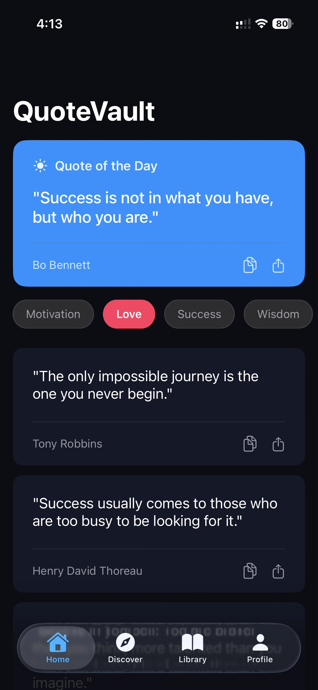
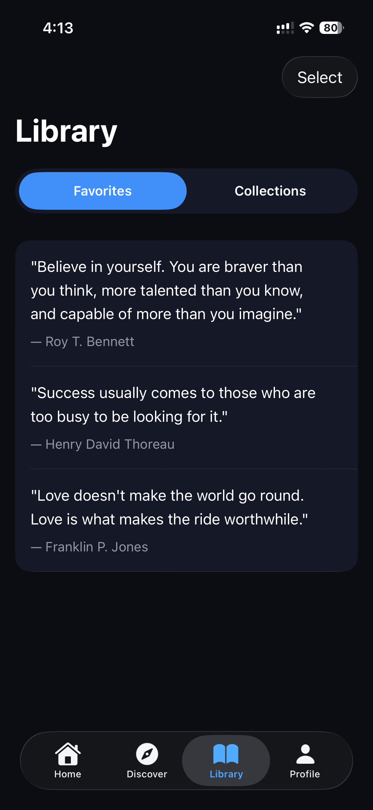
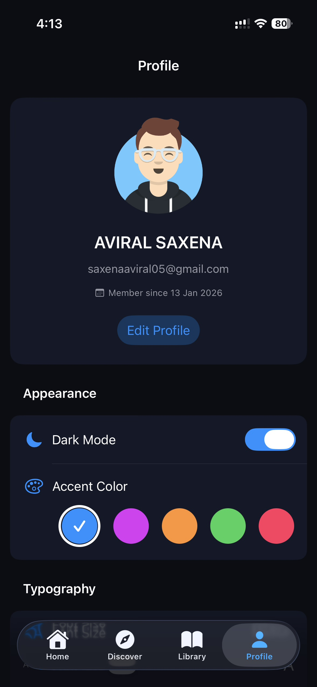
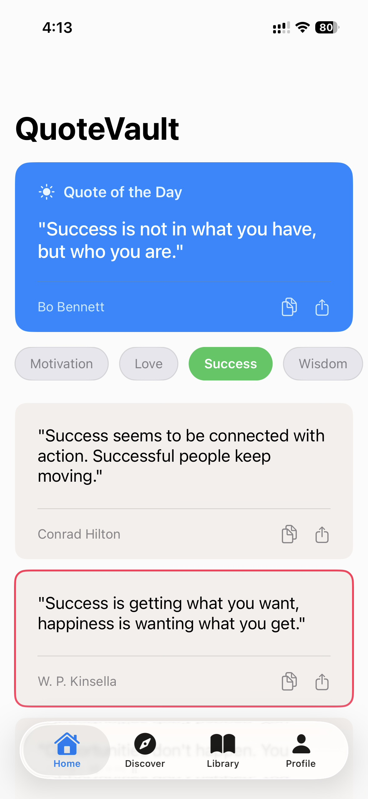
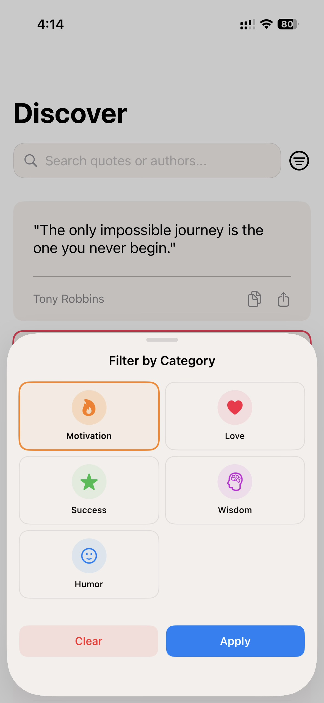
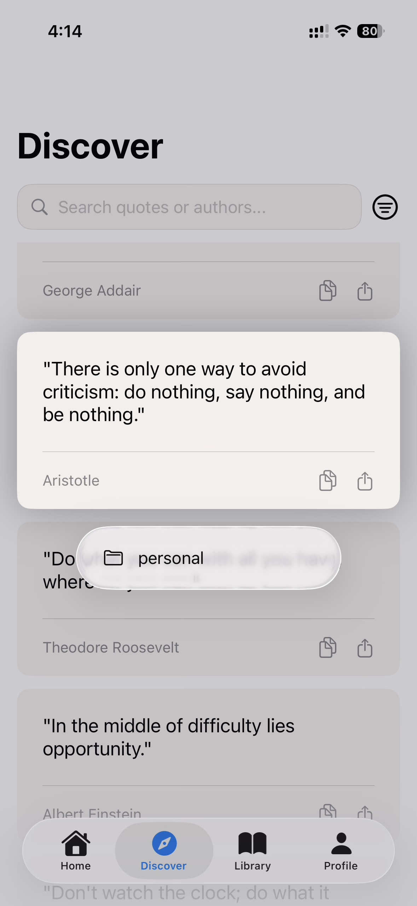
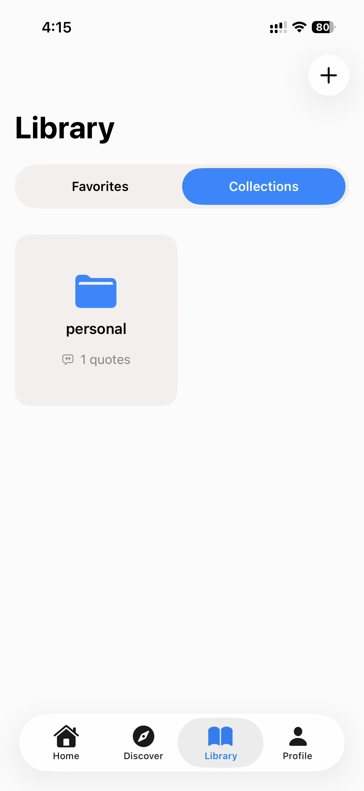
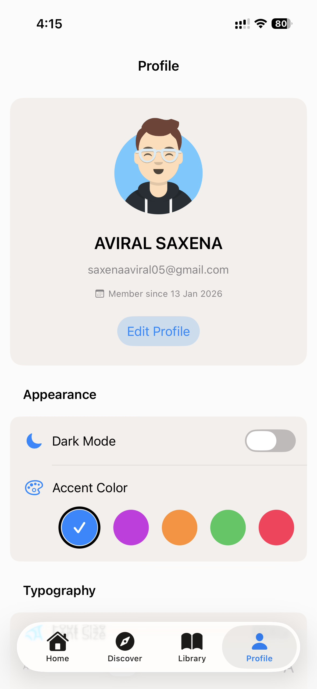
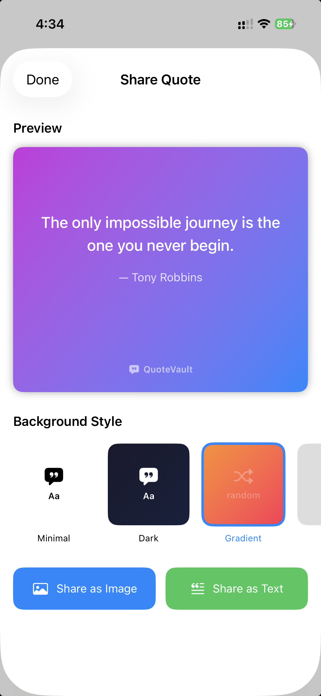

# QuoteVault

A beautiful iOS app for discovering, saving, and sharing inspirational quotes. Built with SwiftUI and Supabase.


## Features

- **Quote Discovery** - Browse 100+ quotes across 5 categories (Motivation, Love, Success, Wisdom, Humor)
- **Quote of the Day** - Daily featured quote with notifications
- **Favorites** - Save and sync favorite quotes across devices
- **Collections** - Organize quotes into custom collections
- **Share Cards** - Generate beautiful quote cards with multiple styles
- **Home Screen Widget** - View daily quotes without opening the app
- **Theming** - Dark/light mode, accent colors, and font size customization
- **Profile Avatars** - Choose from preset profile images

## Screenshots

<!-- Row 1: 5 images -->
<p align="center">
  
  
  
  
  
</p>

<!-- Row 2: 5 images -->
<p align="center">
  
  
  
  
  
</p>

---

## Setup Instructions

### Prerequisites

- Xcode 15.0+
- iOS 17.0+ device or simulator
- Supabase account (free tier works)

### 1. Clone the Repository

```bash
git clone https://github.com/yourusername/QuoteVault.git
cd QuoteVault
```

### 2. Supabase Configuration

#### Create a Supabase Project

1. Go to [supabase.com](https://supabase.com) and create a new project
2. Note your **Project URL** and **anon/public key** from Settings > API

#### Set Up Database Schema

Run these SQL commands in your Supabase SQL Editor:

```sql
-- Users table (extends Supabase auth.users)
CREATE TABLE public.profiles (
    id UUID REFERENCES auth.users(id) PRIMARY KEY,
    display_name TEXT,
    avatar_url TEXT,
    created_at TIMESTAMPTZ DEFAULT NOW(),
    updated_at TIMESTAMPTZ DEFAULT NOW()
);

-- Quotes table
CREATE TABLE public.quotes (
    id UUID DEFAULT gen_random_uuid() PRIMARY KEY,
    text TEXT NOT NULL,
    author TEXT NOT NULL,
    category TEXT NOT NULL CHECK (category IN ('motivation', 'love', 'success', 'wisdom', 'humor')),
    created_at TIMESTAMPTZ DEFAULT NOW()
);

-- Favorites table
CREATE TABLE public.favorites (
    id UUID DEFAULT gen_random_uuid() PRIMARY KEY,
    user_id UUID REFERENCES auth.users(id) ON DELETE CASCADE,
    quote_id UUID REFERENCES public.quotes(id) ON DELETE CASCADE,
    created_at TIMESTAMPTZ DEFAULT NOW(),
    UNIQUE(user_id, quote_id)
);

-- Collections table
CREATE TABLE public.collections (
    id UUID DEFAULT gen_random_uuid() PRIMARY KEY,
    user_id UUID REFERENCES auth.users(id) ON DELETE CASCADE,
    name TEXT NOT NULL,
    created_at TIMESTAMPTZ DEFAULT NOW()
);

-- Collection quotes junction table
CREATE TABLE public.collection_quotes (
    id UUID DEFAULT gen_random_uuid() PRIMARY KEY,
    collection_id UUID REFERENCES public.collections(id) ON DELETE CASCADE,
    quote_id UUID REFERENCES public.quotes(id) ON DELETE CASCADE,
    created_at TIMESTAMPTZ DEFAULT NOW(),
    UNIQUE(collection_id, quote_id)
);

-- Enable Row Level Security
ALTER TABLE public.profiles ENABLE ROW LEVEL SECURITY;
ALTER TABLE public.quotes ENABLE ROW LEVEL SECURITY;
ALTER TABLE public.favorites ENABLE ROW LEVEL SECURITY;
ALTER TABLE public.collections ENABLE ROW LEVEL SECURITY;
ALTER TABLE public.collection_quotes ENABLE ROW LEVEL SECURITY;

-- RLS Policies
CREATE POLICY "Public quotes are viewable by everyone" ON public.quotes FOR SELECT USING (true);
CREATE POLICY "Users can view own profile" ON public.profiles FOR SELECT USING (auth.uid() = id);
CREATE POLICY "Users can update own profile" ON public.profiles FOR UPDATE USING (auth.uid() = id);
CREATE POLICY "Users can manage own favorites" ON public.favorites FOR ALL USING (auth.uid() = user_id);
CREATE POLICY "Users can manage own collections" ON public.collections FOR ALL USING (auth.uid() = user_id);
CREATE POLICY "Users can manage own collection quotes" ON public.collection_quotes FOR ALL USING (
    collection_id IN (SELECT id FROM public.collections WHERE user_id = auth.uid())
);
```

#### Seed Quotes Data

Insert sample quotes (at least 100 across all categories) into the `quotes` table.

### 3. Configure Environment

Add your Supabase credentials to `Info.plist`:

```xml
<key>SUPABASE_URL</key>
<string>https://your-project.supabase.co</string>
<key>SUPABASE_ANON_KEY</key>
<string>your-anon-key-here</string>
```

Or create a `.env` file (for local development):

```
SUPABASE_URL=https://your-project.supabase.co
SUPABASE_ANON_KEY=your-anon-key-here
```

### 4. Build and Run

1. Open `QuoteVault.xcodeproj` in Xcode
2. Wait for Swift Package Manager to resolve dependencies
3. Select your target device/simulator
4. Press `Cmd + R` to build and run

### 5. Widget Setup

To enable the home screen widget:
1. Add the widget to your home screen
2. The widget shares data via App Groups
3. Ensure both app and widget extension have the same App Group configured

---

## AI Coding Approach & Workflow

This project was built using an **AI-assisted development workflow** with the following approach:

### Development Process

1. **Spec-Driven Development** - Started with detailed requirements and design documents in `.kiro/specs/`
2. **Iterative Implementation** - Built features incrementally with continuous testing
3. **Code Review & Refinement** - AI suggested improvements for code quality, accessibility, and performance
4. **Bug Fixing** - Rapid identification and resolution of issues through AI analysis

### Workflow

```
Requirements → Design → Implementation → Testing → Refinement
     ↑                                              ↓
     └──────────── Feedback Loop ──────────────────┘
```

### Key Principles

- **MVVM Architecture** - Clean separation of concerns
- **Protocol-Oriented Design** - Testable and mockable services
- **SwiftUI Best Practices** - Modern declarative UI patterns
- **Minimal Code** - Focused implementations without unnecessary complexity

---

## AI Tools Used

| Tool | Purpose |
|------|---------|
| **Kiro (Claude)** | Primary AI coding assistant for implementation, debugging, and code review |
| **Xcode** | IDE for iOS development |
| **Swift Package Manager** | Dependency management |
| **Supabase** | Backend-as-a-Service (Auth, Database, Storage) |

### Dependencies

- [Supabase Swift SDK](https://github.com/supabase/supabase-swift) - Backend integration

---

## Design Resources

### Figma/Stitch Designs

*Add your design links here:*

- Figma: `[Your Figma Link]`
- Stitch: `[Your Stitch Link]`

### Design System

- **Colors**: Custom background and card colors with dark/light mode support
- **Typography**: SF Pro with customizable sizes (Small, Medium, Large, Extra Large)
- **Accent Colors**: Blue, Purple, Orange, Green, Pink

---

## Project Structure

```
QuoteVault/
├── Config/              # Supabase configuration
├── Models/              # Data models (Quote, User, Collection)
├── Services/            # Business logic services
│   ├── AuthService      # Authentication
│   ├── QuoteService     # Quote fetching & caching
│   ├── CollectionManager # Collections & favorites
│   ├── ThemeManager     # App theming
│   ├── NotificationScheduler # Push notifications
│   └── ShareGenerator   # Quote card generation
├── ViewModels/          # MVVM view models
├── Views/               # SwiftUI views
│   ├── Auth/            # Login, SignUp, ForgotPassword
│   ├── Home/            # Main quote feed
│   ├── Favorites/       # Saved quotes
│   ├── Collections/     # Custom collections
│   ├── Profile/         # User profile & settings
│   ├── Share/           # Quote card sharing
│   └── Components/      # Reusable UI components
├── Validators/          # Input validation
└── Extensions/          # Swift extensions

QuoteVaultWidget/        # Home screen widget
QuoteVaultTests/         # Unit & property tests
```

---

## Known Limitations & Incomplete Features

### Current Limitations

1. **Offline Mode** - Basic caching implemented; full offline sync pending
2. **Widget Refresh** - Widget updates on app launch; background refresh limited by iOS
3. **Profile Images** - Limited to 2 preset avatars (no custom photo upload)
4. **Search** - Client-side filtering; server-side search not implemented

### Potential Improvements

- [ ] Add more quote categories
- [ ] Implement quote submission by users
- [ ] Add social features (follow users, share collections)
- [ ] Implement iCloud sync as Supabase alternative
- [ ] Add Apple Sign-In
- [ ] Localization support

### Known Issues

- Widget may show stale data until app is opened
- Large collections may have performance impact on older devices

---

## Testing

Run tests in Xcode:

```bash
Cmd + U
```

Test coverage includes:
- Validator tests (email, password validation)
- Service property tests
- Collection manager tests
- Theme manager tests

---

## License

This project is for educational purposes.

---

## Author

Built with ❤️ using SwiftUI and AI assistance.
